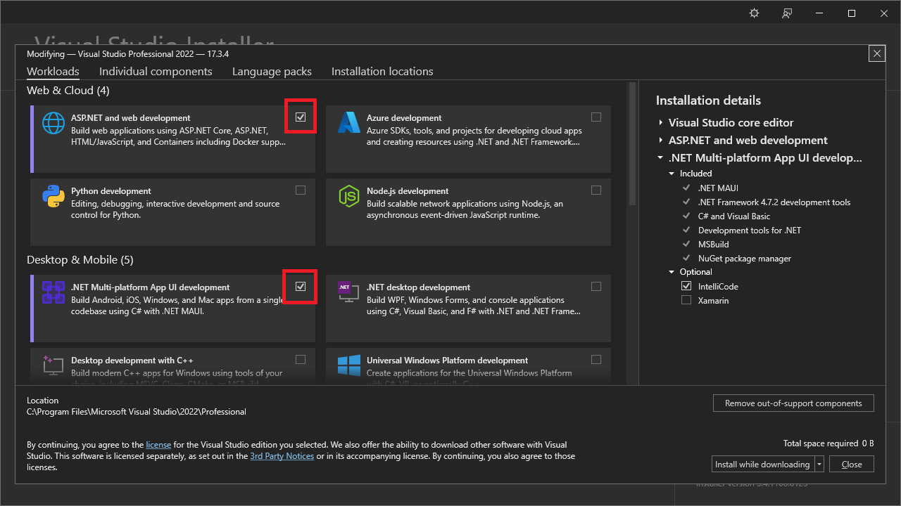
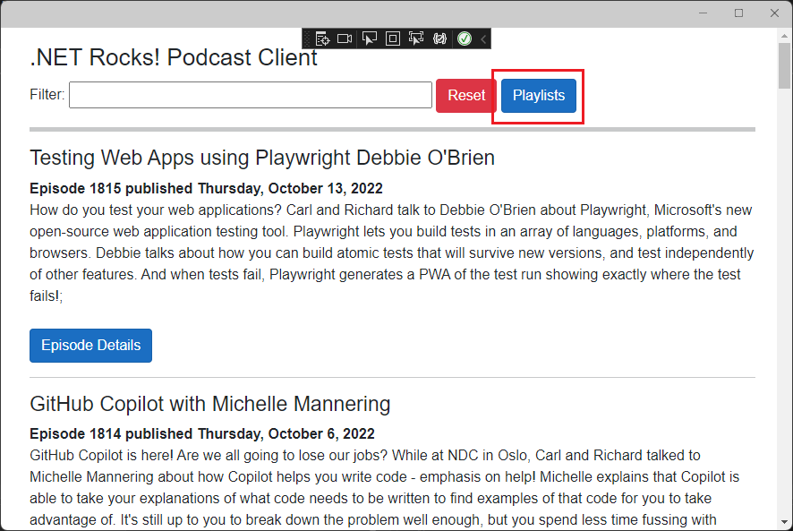
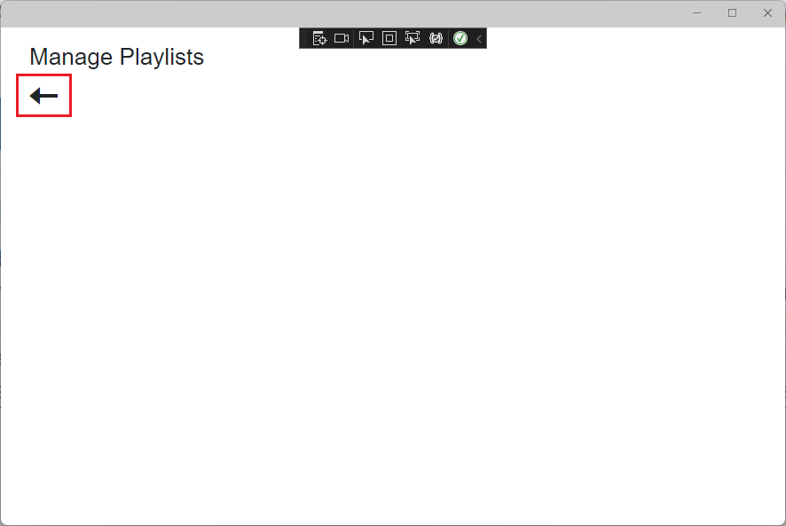
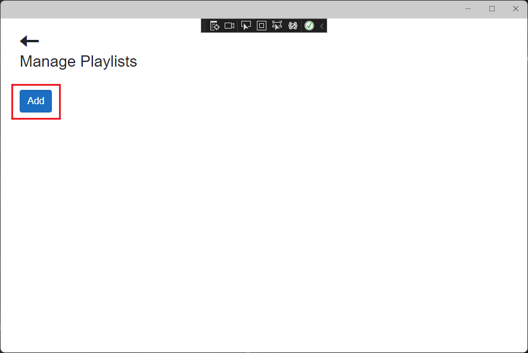
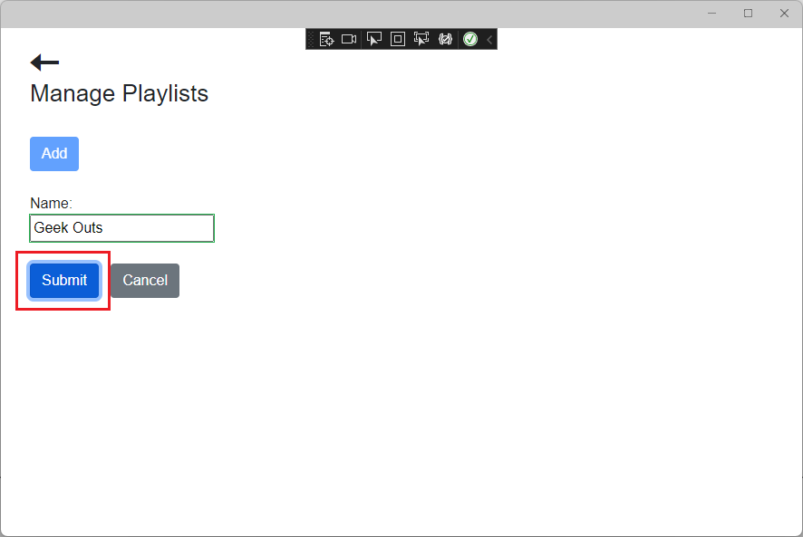
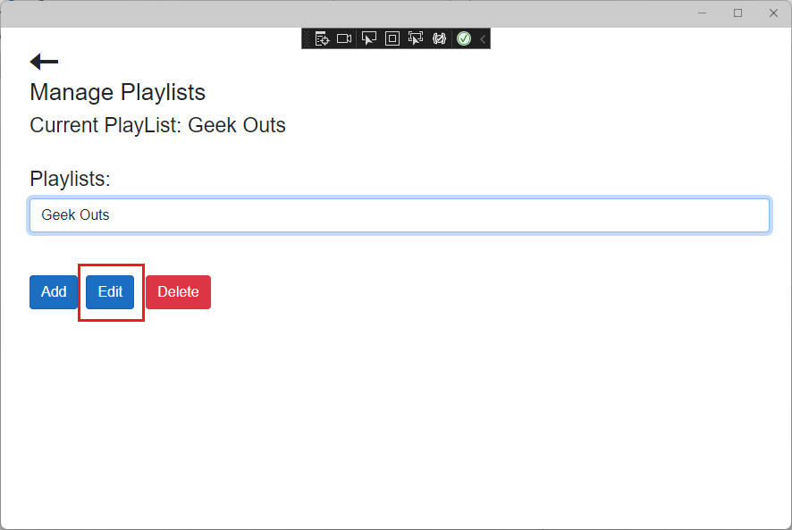
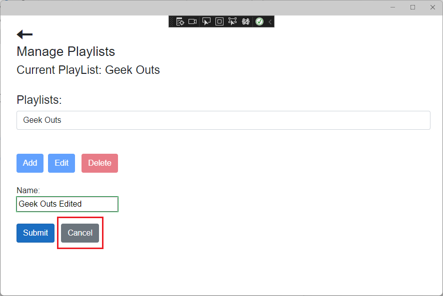
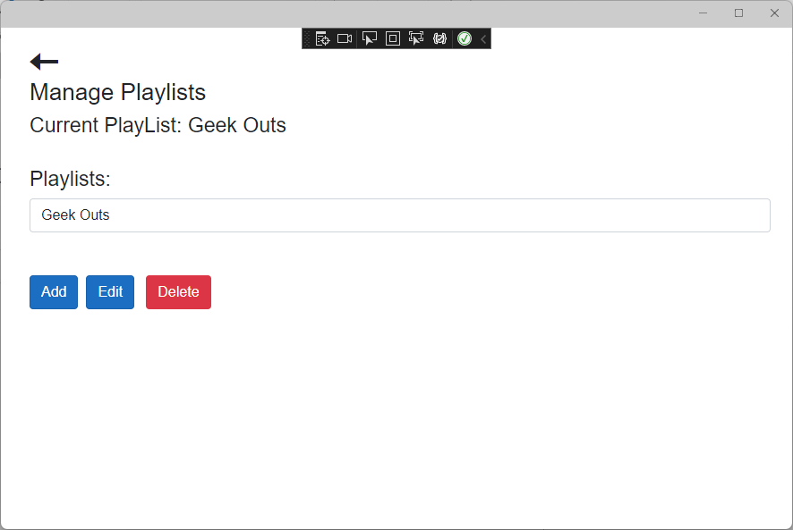

# Building a Mobile Podcast Client App in MAUI Blazor Part 2

## Overview

In episode 28 of [The .NET Show](https://www.thedotnetshow.com/), I started building a Podcast Client MAUI app using Blazor as the UI for my long-running podcast, [.NET Rocks](https://www.dotnetrocks.com/). In this episode (30) I will continue adding on to this app with guests and links showing in the Details page. I will also get a head start on the Playlist functionality, which allows the user to manage and use playlists (lists of shows that should play one-after another).

This is the second in a series of episodes where we take this app from nothing all the way to the app store.

This type of app is called a Mobile Hybrid app. Yes, we're using Blazor, a web UI technology, but the code has access to the native platform: Windows, MacOS, iOS, and Android.

### GitHub Repos: 

- https://github.com/carlfranklin/MAUIDnr1 (Episode 28)
- https://github.com/carlfranklin/MAUIDnr2 (Episode 30)

### Prerequisites

Install the latest version of Visual Studio 2022 and select the `Web & Cloud` and `Desktop & Mobile` workloads.



#### Start with the `MAUIDnr1` MAUI Blazor App from episode 28

Clone the repo at https://github.com/carlfranklin/MAUIDnr1 or rebuild it from scratch using the instructions in the README file.

In the last episode I had some unnecessary code that loaded the show details twice, and also didn't check for nulls. Let's fix that.

Replace the `OnInitializedAsync` method in the *Pages/Details.razor.cs* file with the following:

```c#
protected override async Task OnInitializedAsync()
{
    if (ShowNumber != null)
    {
        try
        {
            int showNumber = Convert.ToInt32(ShowNumber);
            ThisShow = await _apiService.GetShowWithDetails(showNumber);
            if (ThisShow != null)
                url = ThisShow.ShowDetails.File.Url;
        }
        catch (Exception ex)
        {
        }
    }
}
```

##### Show Guests

Add the following Razor markup to *Details.razor* just below line 42: `<div> @AudioMessage @PlayPosition</div>`:

```c#
<br/>
@foreach (var guest in ThisShow.ShowDetails.Guests)
{
    <h3>@guest.Name</h3>
    <div style="padding:20px;">
        
        <div>@guest.Bio</div>
    </div>
    <br clear="left" />
}
```

##### Show Links

Right below that, add the following to show the links:

```c#
<h3>Links:</h3>
<div style="padding-left:20px;">
    @foreach (var link in ThisShow.ShowDetails.Links)
    {
        <a style="padding-bottom:10px;" target="_blank" href="@link.Url">@link.Text</a>
        <br/>
    }
</div>
<br />
```

Run the App (F5) and select a show to see the details:


### Playlist Functionality

In this module we will begin the playlist functionality, but we will only go as far as to manage the playlists. We will implement the playlists in another episode.

Replace *Globals.cs* with the following:

```c#
#if WINDOWS
using Microsoft.UI;
using Microsoft.UI.Windowing;
using Windows.Graphics;
#endif

using Newtonsoft.Json;
using System.Collections.ObjectModel;

public static class Globals
{
    public static readonly int WindowWidth = 900;
    public static readonly int WindowHeight = 600;
#if WINDOWS
    public static Microsoft.UI.Windowing.AppWindow AppWindow {get;set;}
#endif

    // list of all playlists
    public static ObservableCollection<PlayList> PlayLists { get; set; }
    	= new ObservableCollection<PlayList>();

    // currently selected playlist
    public static PlayList SelectedPlayList { get; set; }

    // path to the json file
    private static string playListJsonFile = "";

    public static void LoadPlaylists()
    {
        string cacheDir = FileSystem.Current.CacheDirectory;
        playListJsonFile = $"{cacheDir}\\playlists.json";
        try
        {
            if (System.IO.File.Exists(playListJsonFile))
            {
                string json = System.IO.File.ReadAllText(playListJsonFile);
                var list = JsonConvert.DeserializeObject<List<PlayList>>(json);
                PlayLists = new ObservableCollection<PlayList>(list);
            }
        }
        catch (Exception ex)
        {

        }
    }

    public static void SavePlaylists()
    {
        if (playListJsonFile == "")
            LoadPlaylists();

        var list = PlayLists.ToList();
        var json = JsonConvert.SerializeObject(list);
        System.IO.File.WriteAllText(playListJsonFile, json);
    }
}
```

I've added a static `ObservableCollection<PlayList>`  called `Playlists`, which will contain all the playlists. 

I've also added methods to load and save the playlists in the cache folder.

Add a new Razor Component to the *Pages* folder:

*Playlists.razor*:

```html
@page "/playlists"

<h3>Manage Playlists</h3>

<span @onclick="NavigateHome" class="oi oi-arrow-left"
      style="zoom:2;" aria-hidden="true"></span>
```

Add a code-behind file *Playlists.razor.cs* to the *Pages* folder:

```c#
using Microsoft.AspNetCore.Components;

namespace MAUIDnr1.Pages
{
    public partial class Playlists : ComponentBase
    {
        [Inject]
        protected NavigationManager _navigationManager { get; set; }

        protected void NavigateHome()
        {
            _navigationManager.NavigateTo("/");
        }
    }
}
```

Over in *Pages/Index.razor.cs*, add the following method:

```c#
public void NavigateToPlayListPage()
{
    _navigationManager.NavigateTo("playlists");
}
```

Now, add a `<button>` on line 8 of *Index.razor* (just under the Reset button) to call our new navigate method:

```html
<button class="btn btn-primary" @onclick="NavigateToPlayListPage">Playlists</button>
```

Replace the `OnInitializedAsync()` method in *Index.razor.cs* with the following:

```c#
protected override async Task OnInitializedAsync()
{
    Globals.LoadPlaylists();
    await GetNextBatchOfShows();
}
```

Run the App (F5) and confirm that you can navigate to the **Playlist** page and back.





#### Add CRUD Functionality

Now let's wire up the Playlists page with basic functions to add, retrieve (select), update, and delete playlists.

First, we need an enumeration that will let us know whether we're adding, editing, or neither.

To the *Models* folder, add the following class file:

*PlaylistEditAction.cs*:

```c#
namespace MAUIDnr1.Models
{
    public enum PlaylistEditAction
    {
        None,
        Adding,
        Editing
    }
}
```

In order to be able to cancel an edit or add function, we're going to implement `ICloneable` in the model. That allows us to make a copy of the object when we need to.

Replace *Models/Playlist.cs* with the following:

```c#
using System.ComponentModel.DataAnnotations;

namespace MAUIDnr1.Models
{
    public class PlayList :ICloneable
    {
        public Guid Id { get; set; }
        
        [Required]  
        public string Name { get; set; } = "";
        public DateTime DateCreated { get; set; }
        public List<Show> Shows { get; set; } = new List<Show>();

        public static Guid CreateGuid()
        {
            var obj = new object();
            var rnd = new Random(obj.GetHashCode());
            var bytes = new byte[16];
            rnd.NextBytes(bytes);
            return new Guid(bytes);
        }

        public object Clone()
        {
            return new PlayList()
            {
                Id = this.Id,
                Name = this.Name,
                DateCreated = this.DateCreated,
                Shows = this.Shows
            };
        }
    }
}
```

Besides `ICloneable`, I've added a static method to create a `Guid`, and specified that the `Name` property is required.

Replace *Pages/Playlists.razor.cs* with the following:

```c#
using Microsoft.AspNetCore.Components;

namespace MAUIDnr1.Pages
{
    public partial class Playlists : ComponentBase
    {
        [Inject]
        protected NavigationManager _navigationManager { get; set; }

        // Are we adding, editing, or neither?
        protected PlaylistEditAction PlaylistEditAction { get; set; }

        // Used to disable the command buttons if we're adding or editing
        protected bool CommandButtonsDisabled => 
            (PlaylistEditAction != PlaylistEditAction.None);

        // This is the PlayList object we use to add or edit
        protected PlayList PlayListToAddOrEdit;

        /// <summary>
        /// Go back
        /// </summary>
        protected void NavigateHome()
        {
            _navigationManager.NavigateTo("/");
        }

        /// <summary>
        /// Set the selected playlist when selected from the <select> element
        /// </summary>
        /// <param name="args"></param>
        protected void PlayListSelected(ChangeEventArgs args)
        {
            Globals.SelectedPlayList = (from x in Globals.PlayLists 
                                        where x.Id.ToString() == args.Value.ToString()
                                        select x).FirstOrDefault();
        }

        /// <summary>
        /// Because PlayListSelected won't fire when there is only one item in the list
        /// </summary>
        protected void PlayListsClicked()
        {
            if (Globals.PlayLists.Count == 1)
            {
                Globals.SelectedPlayList = Globals.PlayLists.First();
            }
        }

        /// <summary>
        /// Add a PlayList
        /// </summary>
        protected void AddButtonClicked()
        {
            // Create a new PlayList
            PlayListToAddOrEdit = new PlayList();
            PlayListToAddOrEdit.Id = PlayList.CreateGuid(); // don't forget this!
            PlayListToAddOrEdit.DateCreated = DateTime.Now;
            PlaylistEditAction = PlaylistEditAction.Adding;
        }

        /// <summary>
        /// Edit the SelectedPlayList
        /// </summary>
        protected void EditButtonClicked()
        {
            // Clone it, so we don't clobber it accidentally.
            PlayListToAddOrEdit = (PlayList)Globals.SelectedPlayList.Clone();
            PlaylistEditAction = PlaylistEditAction.Editing;
        }

        /// <summary>
        /// Easy Peasy
        /// </summary>
        protected void DeleteButtonClicked()
        {
            Globals.PlayLists.Remove(Globals.SelectedPlayList);
            Globals.SavePlaylists();
            Globals.SelectedPlayList = null;
            PlaylistEditAction = PlaylistEditAction.None;
        }

        /// <summary>
        /// Commit the Add or Edit action
        /// </summary>
        protected void SubmitPlayListClicked()
        {
            if (PlaylistEditAction == PlaylistEditAction.Adding)
            {
                // Simply add the new PlayList.
                Globals.PlayLists.Add(PlayListToAddOrEdit);
                // Select it
                int index = Globals.PlayLists.IndexOf(PlayListToAddOrEdit);
                Globals.SelectedPlayList = Globals.PlayLists[index];
            }
            else if (PlaylistEditAction == PlaylistEditAction.Editing)
            {
                // Get the index of the selected play list
                int index = Globals.PlayLists.IndexOf(Globals.SelectedPlayList);
                // Replace it in the list
                Globals.PlayLists[index] = PlayListToAddOrEdit;
                // Get the new object reference
                Globals.SelectedPlayList = Globals.PlayLists[index];
            }
            // Save the data!
            Globals.SavePlaylists();
            PlaylistEditAction = PlaylistEditAction.None;
        }

        /// <summary>
        /// Easy Peasy
        /// </summary>
        protected void CancelButtonPressed()
        {
            PlayListToAddOrEdit = null;
            PlaylistEditAction = PlaylistEditAction.None;
        }
    }
}
```

Replace *Pages/Playlists.razor* with the following:

```xml
@page "/playlists"

<div>
    <span @onclick="NavigateHome" class="oi oi-arrow-left"
          style="zoom:2;" aria-hidden="true"></span>
</div>

<h3>Manage Playlists</h3>

@if (Globals.SelectedPlayList != null)
{
    <h4>Current PlayList: @Globals.SelectedPlayList.Name</h4>
}
<br />

@if (Globals.PlayLists.Count > 0)
{
    <h4>Playlists:</h4>
    <select class="form-control" @onchange="PlayListSelected" 
            @onclick="PlayListsClicked" style="width:100%;">
        @foreach (var playList in Globals.PlayLists)
        {
            if (Globals.SelectedPlayList != null 
                && @playList == Globals.SelectedPlayList)
            {
                <option selected value="@playList.Id">@playList.Name</option>
            }
            else
            {
                <option value="@playList.Id">@playList.Name</option>
            }
        }
    </select>
    <br />
    <br />
}
<div>
    <button disabled="@CommandButtonsDisabled" class="btn btn-primary"
            @onclick="AddButtonClicked">Add</button>
    @if (Globals.SelectedPlayList != null)
    {
        <span>&nbsp;</span>
        <button disabled="@CommandButtonsDisabled" class="btn btn-primary"
                @onclick="EditButtonClicked">Edit</button>
        <span>&nbsp;</span>
        <button disabled="@CommandButtonsDisabled" class="btn btn-danger"
                @onclick="DeleteButtonClicked">Delete</button>
    }
</div>
<br/>

@if (PlaylistEditAction != PlaylistEditAction.None)
{
    <EditForm Model="PlayListToAddOrEdit" OnValidSubmit="SubmitPlayListClicked">
        <DataAnnotationsValidator/>

        Name:
        <br/>
        <InputText @bind-Value="@PlayListToAddOrEdit.Name" />
        <br />
        <br />
        <button class="btn btn-primary" type="submit">Submit</button>
        <span>&nbsp;</span>
        <button @onclick="CancelButtonPressed" class="btn btn-secondary"
                type="button">Cancel</button>

        <ValidationSummary />
    </EditForm>
}
```

Run the App (F5)

Navigate to the **Playlists** page and experiment with adding, editing, and deleting playlists.

Close the app and run it again to confirm that your changes will persist between sessions.











#### Markup and Code Details

This markup uses the objects in the static `Globals` class.

At the top of *Playlist.razor* we're showing the currently selected PlayList:

```c#
@if (Globals.SelectedPlayList != null)
{
    <h4>Current PlayList: @Globals.SelectedPlayList.Name</h4>
}
<br />
```

The next section shows a dropdown list of the Playlists we've already created, but only if we have some in our collection:

```c#
@if (Globals.PlayLists.Count > 0)
{
    <h4>Playlists:</h4>
    <select class="form-control" @onchange="PlayListSelected" 
        	@onclick="PlayListsClicked" style="width:100%;">
        @foreach (var playList in Globals.PlayLists)
        {
            if (Globals.SelectedPlayList != null 
                && @playList == Globals.SelectedPlayList)
            {
                <option selected value="@playList.Id">@playList.Name</option>
            }
            else
            {
                <option value="@playList.Id">@playList.Name</option>
            }
        }
    </select>
    <br />
    <br />
}
```

Notice that we're not only handling the onchange event (`@onchange="PlayListSelected"`) but also the onclicked event (`@onclick="PlayListsClicked"`).

This is because if there's only one item in a list, it can't be selected. 

Check out the `PlayListSelected` event handler:

```c#
protected void PlayListSelected(ChangeEventArgs args)
{
    Globals.SelectedPlayList = (from x in Globals.PlayLists 
                                where x.Id.ToString() == args.Value.ToString() 
                                select x).FirstOrDefault();
}
```

This only happens when there's more than one item in the list. 

Here we're setting the `Globals.SelectedPlayList` to the selected item using a little LINQ.

Now check out the `PlayListsClicked` event handler:

```c#
protected void PlayListsClicked()
{
    if (Globals.PlayLists.Count == 1)
    {
        Globals.SelectedPlayList = Globals.PlayLists.First();
    }
}
```

This will happen every time the `<select>` element is clicked.

We're only setting the `Globals.SelectedPlayList` if there's only one item in the list.

##### CRUD Operations

We have defined a `PlayList` object called `PlayListToAddOrEdit`:

```c#
protected PlayList PlayListToAddOrEdit;
```

In the markup, we have an `<EditForm>` component that is only shown if we're adding or editing:

```xml
@if (PlaylistEditAction != PlaylistEditAction.None)
{
    <EditForm Model="PlayListToAddOrEdit" OnValidSubmit="SubmitPlayListClicked">
        <DataAnnotationsValidator/>

        Name:
        <br/>
        <InputText @bind-Value="@PlayListToAddOrEdit.Name" />
        <br />
        <br />
        <button class="btn btn-primary" type="submit">Submit</button>
        <span>&nbsp;</span>
        <button @onclick="CancelButtonPressed" class="btn btn-secondary"
                type="button">Cancel</button>

        <ValidationSummary />
    </EditForm>
}
```

The `Model="PlayListToAddOrEdit"` parameter tells Blazor that we're using the `PlayListToAddOrEdit` object as the model.

There is only one input item, which is bound to the `Name` property of `PlayListToAddOrEdit`:

```xml
<InputText @bind-Value="@PlayListToAddOrEdit.Name" />
```

This component here...

```xml
<DataAnnotationsValidator/>
```

Tells the `<EditForm>` that we are validating against the data annotations in the model. In this case we only have one, the `[Required]` tag on the `Name` property.

There are two buttons, one for submitting the form, and another for canceling.

Notice that in order for the **Cancel** button to work, we have to set `type="button"` otherwise it will be considered another submit button:

```xml
<button @onclick="CancelButtonPressed" class="btn btn-secondary"
    type="button">Cancel</button>
```

For the CRUD functions themselves, let's start with adding a playlist, which happens when we click the **Add** button:

```c#
protected void AddButtonClicked()
{
    // Create a new PlayList
    PlayListToAddOrEdit = new PlayList();
    PlayListToAddOrEdit.Id = PlayList.CreateGuid(); // don't forget this!
    PlaylistEditAction = PlaylistEditAction.Adding;
}
```

All we have to do is set `PlayListToAddOrEdit` to a new `Playlist`, create a new GUID for its `Id` property, and then set the `PlaylistEditAction` to `PlaylistEditAction.Adding`.

Since this method is called from a UI interaction, it will force a render upon exit, and that will show the `<EditForm>`.

Now, let's say that the **Name** field is not blank, and the **Submit** button is pressed.

```c#
protected void SubmitPlayListClicked()
{
    if (PlaylistEditAction == PlaylistEditAction.Adding)
    {
        // Simply add the new PlayList.
        Globals.PlayLists.Add(PlayListToAddOrEdit);
        // Select it
        int index = Globals.PlayLists.IndexOf(PlayListToAddOrEdit);
        Globals.SelectedPlayList = Globals.PlayLists[index];
    }
    else if (PlaylistEditAction == PlaylistEditAction.Editing)
    {
        // Get the index of the selected play list
        int index = Globals.PlayLists.IndexOf(Globals.SelectedPlayList);
        // Replace it in the list
        Globals.PlayLists[index] = PlayListToAddOrEdit;
        // Get the new object reference
        Globals.SelectedPlayList = Globals.PlayLists[index];
    }
    // Save the data!
    Globals.SavePlaylists();
    PlaylistEditAction = PlaylistEditAction.None;
}
```

### Add indicator to main page (Index)

If the user has selected a playlist, we need a visual indicator on the main page. We will change the **Playlists** button text from "Playlists" to "Playlists ([SelectedPlayList Name])"

To *Index.razor.cs*, add the following read-only property handler:

```c#
public string PlayListButtonText
{
    get
    {
        string value = "Playlists";
        if (Globals.SelectedPlayList != null)
        {
            value += $" ({Globals.SelectedPlayList.Name})";
        }
        return value;
    }
}
```

Modify line 8 in *Index.razor*:

```xml
<button class="btn btn-primary" @onclick="NavigateToPlayListPage">@PlayListButtonText</button>
```

Run the App (F5), navigate to the **Playlists** page, select a playlist, and then navigate back to home.


### Stupid JavaScript Trick - Set Focus

When we add or edit a playlist, I want the caret to show up in the **Name** field. It currently doesn't.

In order to do this, we need to use a hack that I've been using in Blazor since it came out.

Add the following to *wwwroot/index.html* at line 26 just above the closing `</body>` tag:

```javascript
<script>
    window.SetFocus = (id) => {
        setFocus(id);
    }

    function setFocus(id) {
        var elem = document.getElementById(id);
        if (elem == null) {
            setTimeout(setFocus, 10, id);
            return;
        }
        elem.focus();
    }
</script>
```

This is a solution to a classic SPA problem. We want to set focus to an element before the element actually exists in the document. I'll explain.

In *Pages/Playlists.razor.cs*, modify the `AddButtonClicked` and `EditButtonClicked` methods to the following:

```c#
/// <summary>
/// Add a PlayList
/// </summary>
protected async Task AddButtonClicked()
{
    // Create a new PlayList
    PlayListToAddOrEdit = new PlayList();
    PlayListToAddOrEdit.Id = PlayList.CreateGuid(); // don't forget this!
    PlaylistEditAction = PlaylistEditAction.Adding;
    await JSRuntime.InvokeVoidAsync("SetFocus", "InputName");
}

/// <summary>
/// Edit the SelectedPlayList
/// </summary>
protected async Task EditButtonClicked()
{
    // Clone it, so we don't clobber it accidentally.
    PlayListToAddOrEdit = (PlayList)Globals.SelectedPlayList.Clone();
    PlaylistEditAction = PlaylistEditAction.Editing;
    await JSRuntime.InvokeVoidAsync("SetFocus", "InputName");
}
```

Notice that we have referred to the `<InputText>` element as having the id "InputName". Let's add that.

Change line 64 in *Playlists.razor* to the following:

```xml
<InputText id="TextName" @bind-Value="@PlayListToAddOrEdit.Name" />
```

Now we need an `IJSRuntime`.

Add this code at line 11:

```c#
[Inject]
protected IJSRuntime JSRuntime { get; set; }
```

Now, let's look at lines 59 and 60:

```c#
PlaylistEditAction = PlaylistEditAction.Adding;
await JSRuntime.InvokeVoidAsync("SetFocus", "InputName");
```

This happens when we click the **Add** button, but before the page is rendered.

That's why our JavaScript code has to keep trying to get an element reference. It may take 10 or 20 ms for the page to render. It may take longer. It doesn't matter. the `setFocus` function keeps calling itself every 10  ms until it gets the reference.

> ***NOTE:*** We will implement the playlist functionality in a future episode.

Run the App (F5) and test out the focus function.

### Persist downloaded metadata

Finally (for now), we need to persist any show data we download so that it can be loaded when we're offline.

To accomplish this, we will modify our `ApiService` to save data we download when we're online, and when we're offline, load that data from disk.

I've also removed the methods we're not using.

Replace *Services/ApiServcice.cs* with the following:

```c#
using System.Text;
using Newtonsoft.Json;

namespace MAUIDnr1.Services;

public class ApiService
{
    private HttpClient httpClient; //
    private string ShowName = "dotnetrocks";
    string baseUrl = "https://pwopclientapi.azurewebsites.net/shows/";

    public ApiService()
    {
        httpClient = new HttpClient() { BaseAddress = new Uri(baseUrl) };
    }

    /// <summary>
    /// returns True if we are connected to the Internet
    /// </summary>
    /// <returns></returns>
    public bool IsOnline()
    {
        return (Connectivity.Current.NetworkAccess == NetworkAccess.Internet);
    }

    /// <summary>
    /// Download all show metadata minus the details
    /// </summary>
    /// <returns></returns>
    public async Task<List<Show>> GetAllShows()
    {
        var fileName = $"{FileSystem.Current.CacheDirectory}\\allShows.json";
        try
        {
            if (IsOnline())
            {
                // We have an Internet connection. Download as usual

                string Url = ShowName;
                var result = await httpClient.GetAsync(Url);
                result.EnsureSuccessStatusCode();
                var response = await result.Content.ReadAsStringAsync();
                var list = JsonConvert.DeserializeObject<List<Show>>(response);

                // write the list to allShows.json in the cache folder
                System.IO.File.WriteAllText(fileName, response);

                return list;
            }
            else if (System.IO.File.Exists(fileName))
            {
                // We are offline, and allShows.json has been written to.
                // Return the items in the saved list
                var json = System.IO.File.ReadAllText(fileName);
                var list = JsonConvert.DeserializeObject<List<Show>>(json);
                return list;
            }
            else
            {
                // we are offline and allShows.json does not exist.
                return new List<Show>();
            }
        }
        catch (Exception ex)
        {
            return new List<Show>();
        }
    }

    /// <summary>
    /// Returns a list of shows in a range where the ShowTitle contains the specified text.
    /// </summary>
    /// <param name="ShowTitle"></param>
    /// <param name="StartIndex"></param>
    /// <param name="Count"></param>
    /// <returns></returns>
    public async Task<List<Show>> GetFilteredShows(string ShowTitle, 
                                                   int StartIndex, int Count)
    {
        try
        {
            if (IsOnline())
            {
                // We have an Internet connection. Download as usual
                string Url = 
                    $"{ShowName}/{ShowTitle}/{StartIndex}/{Count}/getfilteredshows";
                var result = await httpClient.GetAsync(Url);
                result.EnsureSuccessStatusCode();
                var response = await result.Content.ReadAsStringAsync();
                var items = JsonConvert.DeserializeObject<List<Show>>(response);
                // Save each show to it's own Json file
                foreach (var item in items)
                {
                    var fileName = $"{FileSystem.Current.CacheDirectory}\\show-{item.ShowNumber}.json";
                    var showJson = JsonConvert.SerializeObject(item);
                    System.IO.File.WriteAllText(fileName, showJson);
                }
                return items;
            }
            else
            {
                // We are offline. Check for the existence of each show's json file
                var list = new List<Show>();
                int lastIndex = StartIndex + Count;
                for (int index = StartIndex; index < lastIndex; index++)
                {
                    var fileName = 
                        $"{FileSystem.Current.CacheDirectory}\\show-{index}.json";
                    if (System.IO.File.Exists(fileName))
                    {
                        // The file exists. Deserialize it to a Show
                        var showJson = System.IO.File.ReadAllText(fileName);
                        var item = JsonConvert.DeserializeObject<Show>(showJson);
                        // Only return it if the ShowTitle matches
                        if (item.ShowTitle.ToLower().Contains(ShowTitle.ToLower()))
                            list.Add(item);
                    }
                }
                return list;
            }
        }
        catch (Exception ex)
        {
            return new List<Show>();
        }
    }

    public async Task<int> GetCount()
    {
        var fileName = $"{FileSystem.Current.CacheDirectory}\\showsCount.json";
        try
        {
            if (IsOnline())
            {
                // We have an Internet connection. Download as usual
                string Url = $"{ShowName}/getcount";
                var result = await httpClient.GetAsync(Url);
                result.EnsureSuccessStatusCode();
                var response = await result.Content.ReadAsStringAsync();
                // Save the count to showsCount.json
                System.IO.File.WriteAllText(fileName, response);
                return Convert.ToInt32(response);
            }
            else if (System.IO.File.Exists(fileName))
            {
                // Read and return the value from our offline file
                var countString = System.IO.File.ReadAllText(fileName);
                return Convert.ToInt32(countString);
            }
            else 
                return 0;
        }
        catch (Exception ex)
        {
            return 0;
        }
    }

    /// <summary>
    /// Loads a given show with the guests, links, and mp3 file
    /// </summary>
    /// <param name="ShowNumber"></param>
    /// <returns></returns>
    public async Task<Show> GetShowWithDetails(int ShowNumber)
    {
        var fileName = $"{FileSystem.Current.CacheDirectory}\\show-{ShowNumber}.json";
        try
        {
            if (IsOnline())
            {
                // We have an Internet connection. Download as usual
                string Url = $"{ShowName}/{ShowNumber}/getwithdetails";
                var result = await httpClient.GetAsync(Url);
                result.EnsureSuccessStatusCode();
                var response = await result.Content.ReadAsStringAsync();
                var show = JsonConvert.DeserializeObject<Show>(response);

                // save the json file offline
                System.IO.File.WriteAllText(fileName, response);

                return show;
            }
            else if (System.IO.File.Exists(fileName))
            {
                // We are offline and the json file exists. Load it and return
                var json = System.IO.File.ReadAllText(fileName);
                var show = JsonConvert.DeserializeObject<Show>(json);
                // return null if there are no details
                if (show.ShowDetails == null)
                    return null;
                else
                    return show;
            }
            else
            {
                return new Show();
            }
        }
        catch (Exception ex)
        {
            return new Show();
        }
    }

    /// <summary>
    /// Returns the entire list of show numbers
    /// </summary>
    /// <returns></returns>
    public async Task<List<int>> GetShowNumbers()
    {
        var fileName = $"{FileSystem.Current.CacheDirectory}\\showNumbers.json";

        try
        {
            if (IsOnline())
            {
                // We have an Internet connection. Download as usual
                string Url = $"{ShowName}/getshownumbers";
                var result = await httpClient.GetAsync(Url);
                result.EnsureSuccessStatusCode();
                var response = await result.Content.ReadAsStringAsync();
                var list = JsonConvert.DeserializeObject<List<int>>(response);

                // Save the json file offline
                System.IO.File.WriteAllText(fileName, response);

                return list;
            }
            else if (System.IO.File.Exists(fileName))
            {
                // We are offline and the json file exists. Load it and return the list
                var json = System.IO.File.ReadAllText(fileName);
                var list = JsonConvert.DeserializeObject<List<int>>(json);
                return list;
            }
            else
            {
                return new List<int>();
            }
        }
        catch (Exception ex)
        {
            var msg = ex.Message;
            return new List<int>();
        }
    }

    /// <summary>
    /// Returns a batch of shows given a list of shownumbers (and the show name)
    /// </summary>
    /// <param name="Request"></param>
    /// <returns></returns>
    public async Task<List<Show>> GetByShowNumbers(GetByShowNumbersRequest Request)
    {
        try
        {
            if (IsOnline())
            {
                // We have an Internet connection. Download as usual
                var http = new HttpClient();
                var url = baseUrl;
                string json = JsonConvert.SerializeObject(Request);
                var content = new StringContent(json, Encoding.UTF8, "application/json");
                var result = await http.PostAsync(url, content);
                result.EnsureSuccessStatusCode();
                string responseBody = await result.Content.ReadAsStringAsync();
                var shows = JsonConvert.DeserializeObject<List<Show>>(responseBody);

                // Save each show to its own json file
                foreach (var show in shows)
                {
                    var fileName = $"{FileSystem.Current.CacheDirectory}\\show-{show.ShowNumber}.json";
                    var showJson = JsonConvert.SerializeObject(show);
                    System.IO.File.WriteAllText(fileName, showJson);
                }
                return shows;
            }
            else
            {
                // We are offline. Look for each file offline
                var list = new List<Show>();
                foreach (var index in Request.Indexes)
                {
                    var fileName = 
                        $"{FileSystem.Current.CacheDirectory}\\show-{index}.json";
                    if (System.IO.File.Exists(fileName))
                    {
                        // The json file is there. Load it and include it in our list
                        var showJson = System.IO.File.ReadAllText(fileName);
                        var item = JsonConvert.DeserializeObject<Show>(showJson);
                        list.Add(item);
                    }
                }
                return list;
            }
        }
        catch (Exception ex)
        {
            return new List<Show>();
        }
    }
}
```

When online, we are saving all the data to our cache folder in different json files, the names of which come from the data itself (ShowNumber, etc). 

When offline, we attempt to read data from those files.

Read the comments for details.

#### Update Details page

We have one more tweak, and that is to move the **Home Arrow** button on the *Details.razor* page outside of the check to see if `ThisShow` is not null.

Replace *Pages/Details.razor* with the following:

```xml
@page "/details/{ShowNumber}"

<span @onclick="NavigateHome" class="oi oi-arrow-left"
      style="zoom:2;" aria-hidden="true"></span>

@if (ThisShow != null)
{
    <h4>@ThisShow.ShowTitle</h4>
    <span style="font-weight:bold;">
        Episode @ThisShow.ShowNumber published @ThisShow.DatePublished.ToLongDateString()
    </span>

    <div>
        @ThisShow.Description;
    </div>
    <br />

    

    

    

    

    

    <br />
    <progress style="width: 100%; height: 50px;" max="100"
          value="@Percentage"></progress>
    <br />
    <div> @AudioMessage @PlayPosition</div>

    <br/>
    @foreach (var guest in ThisShow.ShowDetails.Guests)
    {
        <h3>@guest.Name</h3>
        <div style="padding:20px;">
            
            <div>@guest.Bio</div>
        </div>
        <br clear="left" />
    }

    <h3>Links:</h3>
    <div style="padding-left:20px;">
    @foreach (var link in ThisShow.ShowDetails.Links)
    {
        <a style="padding-bottom:10px;" target="_blank" href="@link.Url">@link.Text</a>
        <br/>
    }
    </div>
    <br />

}
```

Run the App (F5)

Try loading a few episodes and playing the audio.

Then disconnect from the Internet and run the app again. This time try accessing new episodes and also the ones you played when online.

## Summary

In this episode we picked up where we left off in the code we wrote in episode 28 (https://github.com/carlfranklin/MAUIDnr1).

We added the guest image and bio as well as the links to the *Details.razor* page.

We started the Playlist feature, allowing the user to manage their playlists.

We used JavaScript Interop to set the focus when editing a playlist.

Finally, we modified our `ApiService` to let us access previously downloaded data when offline.

In the next episode we'll implement the Playlist feature.

More to come! Stay tuned to [The .NET Show](https://thedotnetshow.com)

